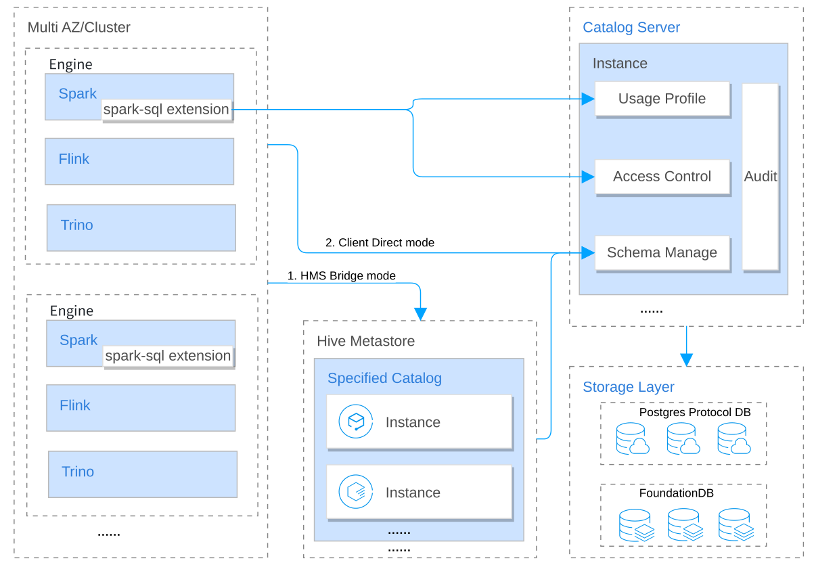

# PolyCat: Cloud-Native Lakehouse Metastore

[中文介绍](中文介绍.md)

## Introduction
Polycat is a cutting-edge cloud-native metastore system, purpose-built to cater to the demands of modern data management in lakehouse deployments. It offers a comprehensive solution for organizations that need to manage metadata from multiple data sources across different clouds, all in one unified platform.

Polycat's advanced metadata management capabilities are designed to deliver a seamless and efficient experience, enabling organizations to easily track and manage metadata across their entire data landscape. Furthermore, its fine-grained access control features, powered by role-based access control (RBAC), ensure that only authorized users can access sensitive data assets. Additionally, Polycat's highly scalable architecture makes it an ideal choice for large-scale data lake deployments, ensuring that organizations can handle massive amounts of data without compromising on performance or efficiency.

Polycat is a powerful, feature-rich metadata management system that enables organizations to efficiently manage data assets across multiple clouds, with granular access control and a comprehensive audit trail, making it the perfect solution for lakehouse data governance.

## Features
**Unified metadata management**
PolyCat provides a unified metadata management system that supports different data sources from multiple clouds. This
means you can easily manage metadata from different types of data sources, like Hive, Iceberg, Hudi, etc. in different
clouds such as AWS, Google Cloud, Azure, etc., in a single place. In this way, PolyCat makes it easy to search and
manage data assets across data silos.

**Enhanced metadata management**
PolyCat is designed to support multiple tenants, with the ability to manage metadata including catalog, database, table
and partition information. Additionally, the system includes support for detailed metadata statistical information.

**Unified data authorization**
Fine-grained access control is critical to ensuring the security and privacy of data assets. PolyCat includes features
for data authorization, allowing you to control who has access to specific data assets and what actions they can perform
on those assets. You can use role-based access control (RBAC) to define access policies that meet your organization's
needs.

**Detailed history traceback**
The metastore keeps track of changes to metadata over time, allowing you to see how data assets have evolved over time.
This feature is particularly useful for auditing purposes or for analyzing changes in your data landscape. You can view
the complete history of a data asset, including changes to its schema, ownership, and other metadata attributes.

**Seamless integrations with your existing tools**
PolyCat supports HMS protocol via HMS bridge, so that existing computing engines like Apache Spark, Apache Flink, Trino,
etc. can seamless interact with PolyCat without any change.

**Highly scalable**
PolyCat is designed to be highly scalable, making it suitable for large-scale data lake deployments. It can easily scale
horizontally as metadata queries grow. In addition, the metastore is designed to support different types of data
storage, like relational databases and distributed databases. Based on estimated data volume. you can choose appropriate
storage.

## Architecture


## Modules

assembly: Integrated executable program compression package
bin: executable script directory
catalog: PolyCat Catalog module is a service that provides metadata management and storage.
  - api: catalog server api definition.
  - audit: Log audit module.
  - authentication: Interface call authentication module.
  - authorization-policyDecisionPoint: Policy-Based Authorization Authentication
  - authticator-oneaccess: Single Access Authentication
  - client: PolyCat sdk
  - hmsbridge-hive2: hms 2.x version in bridge mode
  - hmsbridge-hive3: hms 3.x version in bridge mode
  - iceberg: Iceberg catalog
  - metastore: storage layer model
  - perf-tools: performance monitoring
  - server: catalog server
  - service-api: catalog server interface
  - spark: Spark Catalog
common: General tool collection
conf: configuration
deploy: build catalog yml
dev: dev code style
docker: build docker images
docs: docs
integration: client
lib: external dependencies jars
license: license agreement
license-binary: license agreement
metrics: Monitoring metrics
migration: Migration Metadata Tool
polycat-hiveSDK： Hive client in direct connection mode
probe: Probe module, including authentication and use of portraits
thirdpart： perf4j tools


## Quick Start

To get started with the Cloud-Native Lakehouse Metastore on your own cloud infrastructure, follow these simple steps.

You can perform a local installation with one click, or follow the steps below to quickly set up a test environment of
Hive metastore bridge;

### Prerequisites

Before you begin, you'll need the following:

Compile environment requirements:

- Java JDK 8
- Maven 3.6.1+
- Docker 19.03.1+

### Installation

Clone the Cloud-Native Lakehouse Metastore repository Navigate to the root of the repository in your terminal Run helm
install ./chart to install the metastore Wait for the installation to complete Access the metastore via the endpoint
provided by your cloud provider

```sh
git clone https://github.com/DataCakeCloud/PolyCat
cd $working_dir/PolyCat
mvn clean package -DskipTests -Pdist
```

### Setup a Local Environment with docker

**Execute the following script steps on your command line, It can also be executed in a script**

First, execute the following command: build local docker images.

```shell
cd $working_dir/PolyCat
# build image
sh build-docker.sh
# output >> catalog:latest and hive:v2.3.7 
docker images | grep -E 'catalog|hive'
```

1. Configuration variables

```sh
PROJECT_NAME=project1
CATALOG_NAME=default_catalog

# storage 
PG_NAME=polycat-pg
PG_USER=polycat_test
PG_PASSWORD=polycat_test
PG_DB=polycat_test
PG_PORT=5432

# Catalog server
CS_NAME=catalog
CS_PORT=8082

# Hive metastore server
HMS_NAME=hms
HMS_PORT=9083

# create catalog body
REQ_CATALOG_BODY="{\"accountId\":\"account1\",\"authSourceType\":\"IAM\",\"catalogName\":\"${CATALOG_NAME}\",\"description\":\"\",\"location\":\"/location/uri/\",\"owner\":\"root\",\"ownerType\":\"USER\"}"
REQ_AUTH_HEAD="Authorization:rO0ABXNyADJpby5sYWtlY2F0LmNhdGFsb2cuYXV0aGVudGljYXRpb24ubW9kZWwuTG9jYWxUb2tlbjcmbiYxJvNvAgADTAAJYWNjb3VudElkdAASTGphdmEvbGFuZy9TdHJpbmc7TAAGcGFzc3dkcQB+AAFMAAZ1c2VySWRxAH4AAXhwdAANWmhlSmlhbmdEYVh1ZXQAA2JkcHEAfgAE"

get_ip() {
  local NAME=$1
  echo $(docker inspect ${NAME} | jq -r '.[0].NetworkSettings.Networks.bridge.IPAddress')
}

```

2. Start a PostgreSQL database

```sh 
docker run -d --name $PG_NAME -p5432:$PG_PORT -e POSTGRES_USER=$PG_USER -e POSTGRES_PASSWORD=$PG_PASSWORD -e POSTGRES_DB=$PG_DB -d postgres:13.10
```

3. Start Catalog Server

```sh
docker run -d \
  --name ${CS_NAME} \
  -e SPRING_DATASOURCE_URL="jdbc:postgresql://$(get_ip ${PG_NAME}):${PG_PORT}/${PG_DB}?serverTimezone=UTC" \
  -e SPRING_DATASOURCE_USERNAME=${PG_USER} \
  -e SPRING_DATASOURCE_PASSWORD=${PG_PASSWORD} \
  -e TENANT_PROJECT_NAME=${PROJECT_NAME} \
  -p 8082:${CS_PORT} catalog:latest

```

This will start a new instance of the metastore on port 8082 of your local machine. You can then access the user
interface by navigating to http://localhost:8082/doc.html with swaggerUI in your web browser.

Execute after confirming that the catalog service starts successfully

```shell
## create catalog 
curl -X POST "http://127.0.0.1:${CS_PORT}/v1/${PROJECT_NAME}/catalogs" -H ${REQ_AUTH_HEAD}  -H  "accept:application/json;charset=UTF-8" -H  "Content-Type:application/json" -d ${REQ_CATALOG_BODY}
```

4. Start Hive metastore

```sh
docker run -d \
  --name ${HMS_NAME} \
  -e CATALOG_HOST=$(get_ip ${CS_NAME}) \
  -e CATALOG_PORT=${CS_PORT} \
  -e HIVE_SITE_CONF_datanucleus_schema_autoCreateAll=true \
  -e HIVE_SITE_CONF_hive_metastore_schema_verification=false \
  -e HIVE_SITE_CONF_hive_metastore_rawstore_impl=io.polycat.catalog.hms.hive2.HMSBridgeStore \
  -e HIVE_SITE_CONF_hive_hmsbridge_defaultCatalogName=${CATALOG_NAME} \
  -e HIVE_SITE_CONF_polycat_user_project=${PROJECT_NAME} \
  -p 9083:${HMS_PORT} hive:v2.3.7

```

Thrift URI for the remote metastore(thrift://127.0.0.1:9083). Used by metastore client to connect to remote metastore.

## Get support

- [Slack community: ](https://join.slack.com/t/datacake-workspace/shared_invite/zt-1u2ficwsg-MG8k3gljJGuWrqn3FjKy~Q)
  join technical discussions, ask questions, and meet other users!

## Contributing
We welcome contributions to this project! If you are interested in contributing, please read our [contributing guidelines](.github/GUIDELINE) first.

## License
This project is released under the [Apache License 2.0](https://www.apache.org/licenses/LICENSE-2.0).
