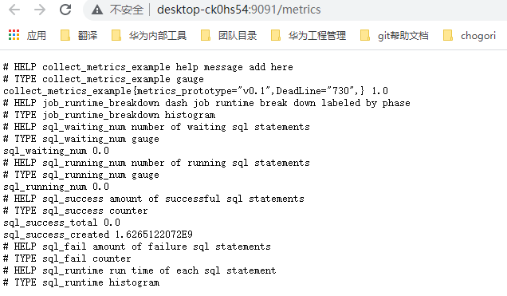

# 基于Prometheus的性能监测

## 需求背景

LMS元数据性能对引擎有较大影响，LMS需要为用户提供监控手段，监测元数据服务的基础性能指标。并且，这些指标应该可让用户进行扩展。

## 如何使用

### Introduction
Dash Metrics是以开源的prometheus风格为基础的指标统计模块。共有四种类型的度量用于各类指标的统计：
1. Counter：此度量只增不减，可用于请求统计等场景（e.g. request_count）
2. Gauge：此度量可增可减，可用于统计反应系统资源使用量等指标 (e.g. memory_used)
3. Histogram：此度量存储采样得到的静态值 (e.g. request_latency or request_size)，并且根据预先给定的范围分桶进行统计。根据分桶，histogram可以快速给出长延迟的数目，通过*histogram_quantile()*函数计算百分位延迟等指标。统计信息由prometheus server计算。
4. Summary：类似于Histogram，可通过*<basename>{quantile="0.5"}*统计延迟中位数指标。统计信息由prometheus client计算。

在拉起dash进程时会启动prometheus httpService服务，开放端口供prometheus server获取统计的指标信息。环境中没有安装prometheus不会影响dash提供正常的服务。通过prometheus + grafana可以提供更丰富和直观的图形化指标界面。（通过命令行直接打印指标信息后续可根据需求实现，但并不直观，对于性能分析调优和监控场景可能都不太好用）

### Prometheus
1)  下载安装包：https://prometheus.io/download/ ，根据环境下载prometheus包并解压。

2)  配置说明：解压后，在文件中修改配置文件。用工程目dash/conf/下的prometheus.yml替换默认的.yml即可。后续也可以在`scrape_configs` 代码块部分，通过`-job_name`添加更多指标抓取任务，通过`scrape_interval`配置拉取时间间隔，通过targets配置拉取地址等。
更多yml配置参考网址：https://prometheus.io/docs/prometheus/latest/configuration/configuration/

3)  启动：通过执行prometheus执行文件启动。通过`--config.file example.yml`指定example.yml为配置文件，不指定则prometheus.yml为默认配置文件。启动后可通过浏览器进入图形化界面，默认端口是本地9090端口 (e.g. 127.0.0.1:9090)。通过Status按钮下的targets可以看到配置文件中拉取目标endpoint节点的状态。up状态表示连通，可以获取到指标。

PS. 如果wsl，在wsl ubuntu中启动prometheus，在windows系统中通过wsl地址:9090访问prometheus server。

在`Targets页面`点进去后就可以查看到对应节点统计的指标信息。也可以通过对应节点`ip:port/metrics`地址查看指标。其格式为：
`#HELP            metrics_name指标名            help_massage帮助信息`
`#TYPE            metrics_name指标名            metrics_type指标类型`
`metrics_name指标名        { labels=“” kv格式的标签信息}        value指标值`

这里显示的值是一个指标最新的值，而为了做性能分析，往往需要一段历史事件的指标变化信息。这时候需要使用它提供的PromQL语言获取更详细的历史指标。

4)  Prometheus UI：通过Graph按钮进入到图形，expression输入栏用于PromQL查询输入。例如我们可以输入定义的`sql_run_count`指标名来查看sql语句执行次数。
注意到，一个指标名的不同labels结果是分开展示的。例如在统计不同类型REST请求指标时，指标名为rest_req_count，根据label的值是GET, POST或 PATCH等可以分开统计各类REST请求的数目。

当然一个指标名的不同labels也可以通过sum函数进行求和来查看总请求数，`sum(rest_req_count{})`。PromQL指导参考网址：
https://yunlzheng.gitbook.io/prometheus-book/parti-prometheus-ji-chu/promql
https://prometheus.io/docs/prometheus/latest/querying/basics/

5)  DASH自定义指标：dash项目可自定义统计指标来分析dash性能。逻辑关系如下图所示。在dash模块中，构建自己的统计指标主要就是实现一个yourCollector.java类，该类继承prometheus client的Collector类，用来定义你想要的统计指标。指标的定义有两种方法，一种是通过声明prometheus提供的四种metrics变量，在程序执行过程中统计关键参数；另一种是通过重载collect（）方法，将系统中已有的统计参数以prometheus格式提供出来。这两种方式都需要在new实例时注册到registry，即让prometheus server可以拉取到该指标，基类已自带了register方法可直接调用。

在工程目录`dash/metrics`模块中，DashServerCollector.java类和DashJobPrepareCollector.java类定义了统计指标，两种指标定义方法均有用例。PromQL查询时便是根据类中的指标名称进行查询的。

### Grafana
Prometheus有他的不足，例如一个graph图表只能执行一个PromQL语句。想要在一张图中展示不同指标名统计的曲线，就不能实现。因此使用grafana获得更好的查询和图形展示能力。

1)	下载安装包：https://grafana.com/grafana/download  ，根据环境下载包并解压安装。

2)	启动grafana：通过grafana-server可执行文件启动，默认会开启:3000端口。可通过浏览器访问图形界面。

3)	添加数据源：通过`settings`按钮的`DataSource -> add data source`选择数据源，添加`prometheus`数据源，配置上文中设置的prometheus server对应地址和端口。

4)	添加panels: 通过`+ -> dashboard`添加图表。点击`add an empty panel`，在metrics browser中可以输入PromQL查询语句进行查看，语句与prometheus中的查询一样。通过增加PromQL语句增加图标显示的维度。

5)	实时监控: 通过加入不同的panels，可以在看板上同时检测多种指标。grafana拥有丰富和直观的多种展示模式。

6)	dashboard模板：当前已提供两个grafana模板，分别监控Catalog Rest API及JVM状态，以及监控carbonSQL执行sql语句过程中的性能分解。模板为了简单方便地直接使用，todo：后续需要根据性能调优相应修改。

### Performance profiling
性能分解和优化的过程并没有Grafana看板展示的那么fancy，特别是分解每条sql语句各步骤的执行耗时时，需要在执行该语句的时刻附近，分解中间过程的耗时。

性能分析举例：在grafana-carbonSqlBreakdown模板中的runtime breakdown图表，就是用来做静态性能分解的。当前将一条sql执行耗时分解成下面几个阶段：`prepare_running`和`stream_running`。其中，prepare_running包括从sql解析到stream真正跑起来之间的4个阶段，分别为compile，analyze，optimize和handlejob。stream_running为streamer运行耗时，分为数据阶段和catalog元数据阶段。
例如下图所示，初步可以看出请求解析和fdb元数据阶段开销大致是数据处理阶段开销的一半，而其中耗时主要发生在fdb的访问以及流引擎处理过程中。
todo：进一步性能分析需要与streamer进一步沟通细化更多指标。

## 如何测试

Prometheus, Grafana都是成熟开源组件，只要验证Dash与这些组件的集成测试即可
