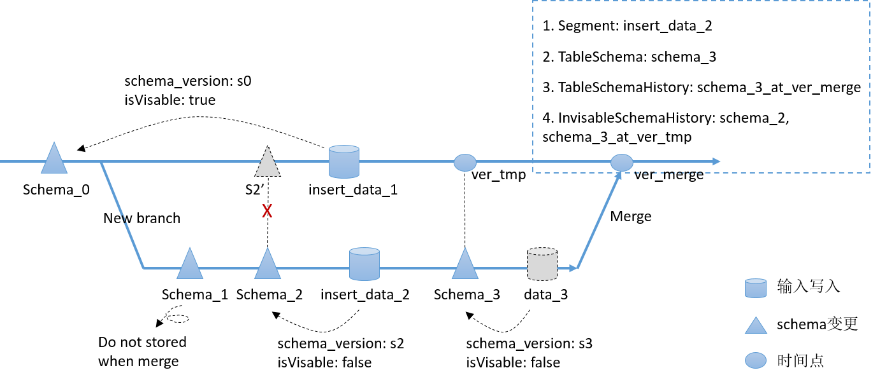

# Branch merging

## 需求背景

当用户在Catalog分支上工作一段时间后，需要将分支的修改合入到另一个分支。

## 如何使用

```
MERGE BRANCH srcBranch [TO destBranch]
```

如果不提供 destBranch，则合并到会话中的当前catalog


## 设计和实现

## 1 branch merge
branch merge动作包含两个子对象merge：database、table； 其他子对象（如：view、share、role）不merge。

merge总原则：对于每个对象，把srcBranch上对象相比于destBranch上新增或修改的数据及元数据append到destBranch上，产生一个新版本，不影响destBranch上对象的历史版本。类似于git上的git pull --merge，等同于git fetch + git merge。

merge特性是很多其他特性的基础，如：
1）并发入库和compaction操作；
2）分支合并操作；
3）多语句事务；

## 2 database对象merge

### 2.1 新database merge
新database只需要把database最新信息和history合入到destBranch。

注意：新database合入时，需要检查database名称在destBranch上是否已存在；同时，合入之后，需要保证有相同的databaseId。

### 2.2 已有database merge
已有database对象变更操作类型有：删除、修改名称、set属性、unset属性。

下表显示srcBranch上已有database merge到destBranch时，不同变更操作的冲突判断原则，第一列表示srcBranch上的变更操作，第一行表示destBranch上变更操作。

| srcBranch.destBranch | drop   | modifyName | setProperties | unsetProperties |
| -------------------- | ------ | ---------- | ------------- | -------------   |
| drop                 | 不冲突  | 不冲突      | 不冲突         | 不冲突           |
| modifyName           | 冲突    | 不冲突      | 不冲突         | 不冲突           |
| setProperties        | 冲突    | 不冲突      | 不冲突         | 不冲突           |
| unsetProperties      | 冲突    | 不冲突      | 不冲突         | 1.unset相同属性冲突；2.不冲突 |

##3 table对象 merge

### 3.1 新table merge
新table只需要把table最新信息和history合入到destBranch。

注意：新table合入时，需要检查table名称在destBranch上是否已存在；同时，合入之后，需要保证有相同的tableId。

### 3.2 已有table merge
对于主键表与非主键表冲突判断及处理逻辑不一样。

已有table对象变更操作类型分为DDL和DML。
1.DDL分为：drop、alter name、alter properties（如：增加属性、删除属性、修改属性值）、alter column（如：增加列、减少列、修改列属性）、alter partition。
2.DML分为：insert、delete、update、overwrite、compaction

#### 3.2.1 非主键表merge

| srcBranch.destBranch | drop | alter name | alter properties | alter column | alter partition | insert | delete | update | overwrite | compaction |
| -------------------- | ---- | ---------- | ---------------- | -------------- | --------------- | ------ | ------ | ------ | --------- | ---------- |
| drop                 | 不冲突 | 不冲突      | 不冲突            | 不冲突        | 不冲突           | 不冲突  | 不冲突   | 不冲突  | 不冲突     |            |
| alter name           | 冲突  | 不冲突      | 不冲突            | 不冲突        | 不冲突           | 不冲突  | 不冲突   | 不冲突  | 不冲突     |            |
| alter properties     | 冲突  | 不冲突      |                  | 不冲突        | 不冲突           | 不冲突  | 不冲突   | 不冲突  | 不冲突     |            |
| alter column         | 冲突  | 不冲突      | 不冲突            | 有条件冲突，见A6 | 不冲突           | 不冲突  | 不冲突   | 不冲突  | 不冲突     |            |
| alter partition      | 冲突  | 不冲突      | 不冲突            | 不冲突        |                 | 不冲突  | 不冲突   | 不冲突  | 不冲突     |            |
| insert               | 冲突  | 不冲突      | 不冲突            | 不冲突        | 不冲突           | 不冲突  | 不冲突   | 不冲突  | 不冲突     |            |
| delete | 冲突 | 不冲突 | 不冲突 | 不冲突 | 不冲突 | 冲突 | 不冲突，见A2 | 不冲突 | 不冲突，见A5 | |
| update               | 冲突  | 不冲突      | 不冲突            | 不冲突        | 不冲突           | 冲突 | 有条件冲突，见A1 | 有条件冲突，见A3 | 不冲突，见A4 |            |
| overwrite            | 冲突  | 不冲突      | 不冲突            | 不冲突        | 不冲突           | 不冲突  | 不冲突   |  不冲突   | 不冲突   |            |
| compaction           | 冲突  | 不冲突      | 不冲突            | 不冲突        | 不冲突           |        |         |          |         |            |

A1: update和delete如果修改涉及相同文件，就冲突。否则，不冲突。

A2: 两个delete修改涉及相同文件，产生delta文件相同，内容可能相同，也可能不同，只需要读数据能处理即可。涉及不同文件，也不冲突。

A3: update和update如果修改涉及相同文件，就冲突。否则，不冲突。

A4: srcBranch上的update操作，如果是分支上新增数据update合入到destBranch；否则，丢弃掉。

A5: srcBranch上的delete操作，如果是分支上新增数据的delete操作，合入到destBranch；否则，丢弃掉。

A6: 以下两个场景会造成冲突：

- A6.1，column类型不兼容。alter column操作在修改列的数据类型时，允许兼容范围更大的数据类型，例如类型是int的列可以通过alter column change将类型修改为long。但long不能修改为int。合并操作时，如果destBranch上的数据类型范围更大，就冲突。

- A6.2，拥有not null属性的列，合并时没有value，并且也没有default vaule填充。该情况往往发生在destBranch新建了一个not null且没有设置default value的列，且在srcBranch做了数据入库。在执行merge branch操作时，not null的数据列没有数据（因为在srcBranch上并没有这个列），且也没有默认值填入，合并冲突。

#### 3.2.2 merge时如何处理Scheme元数据

根据merge的基本原则，（1）合并操作等价于在合并的时间点，在destBranch分支重放一遍srcBranch做过的操作。这样就可以理解为什么只会存在上述schema冲突的情况了，他们都是因为在合并时刻、合并目标分支上，重做时违反了schema变更约定，因此冲突。根据这个思路就可以理解为什么没有列命名的冲突类型，因为如果列同名，即看做没有做修改；如果列不同命，则看做是在merge时刻进行了rename，都不造成冲突。如果命名违规，会在rename那个操作时抛出错误，而不是merge时冲突。

（2）merge时schema元数据和对应数据是如何组织的？尽管分支上会有多次提交，但merge后只会在目标分支生成一个新的提交记录。也就是说，并不是所有子分支上的操作在合并后的主分支上都可见。对于schema来说，

- 合并会存储部分schema，但不是全部的schema版本。有数据写入的那些schema版本，在后续读数据时才会被使用，它们将被保留并作为schema history存储起来；而没有数据写入的schema版本以后再也不会被用到，它们将被丢弃。此过程中存储的历史记录——schemaHistory 记录只需要修改catalog_id为目标分支id，其他字段不变。同时，最后一个版本的schema会作为合并后的最新schema存储在"TableSchema表"中。

  一个schema变更后merge的场景如下图所示，子分支对schema_0连续做了两次变更，但只在schema_2时写入了数据，这种情况合并时就只会存储schema_2，schema_1不存储到主分支上。



- 单独存储中间过程的schema。中间过程的schema是指子分支上除最终schema以外，其他有用的schema。上一点已经说了这些schema的存储格式和内容呢，下面解释为什么他们需要被单独存储。

  继续引用上图的schema变更后merge场景。如果将中间过程的schema存储在TableSchemaHistory中，现在假设主分支合并成功后，进行restore到insert_data_1时刻的操作。这时候需要找到时间节点小于等于insert_data_1时刻的最新的schema作为restore后该分支的schema，那么根据时间轴向前，就找到了S2'作为新的schema。但这个结果是不符合预期的，因为S2‘是一个中间结果，不应该被用户看到。restore后应该使用的版本是schema_0。因此，需要将中间结果（不应该可见的）与真正的提交结果（可见的）隔离开。

  PS. 中间结果和提交结果理论上是可以都放在TableSchemaHistory子空间中的，通过flag区分。但这样需要对系统已有的操作都进行修改。而通过子空间区分是对当前系统侵入最小的方案。

  所以在图例场景中，ver_merge时刻合并完成后，我们看到的最终结果是在不可见的schema历史表（InvisableSchemaHistory）中，插入了两条记录，他们都对应有数据的输入。在可见的schema历史表（TableSchemaHistory）中，插入了一条记录。值得注意的是，这条记录与Schema_3的区别在于，其时戳修改成了合并时的时戳。当然最终在Segment和TableSchema子空间也分别插入各自的记录。

- 数据到对应schema的映射关系。数据的索引，即Segments，被写入到Segment子空间，让我们可以找到数据文件。且每条Segment记录中会记它对应的版本schema_version和对应schema所在子空间isVisable，拿到该版本schema就可以解析出具体表数据内容。