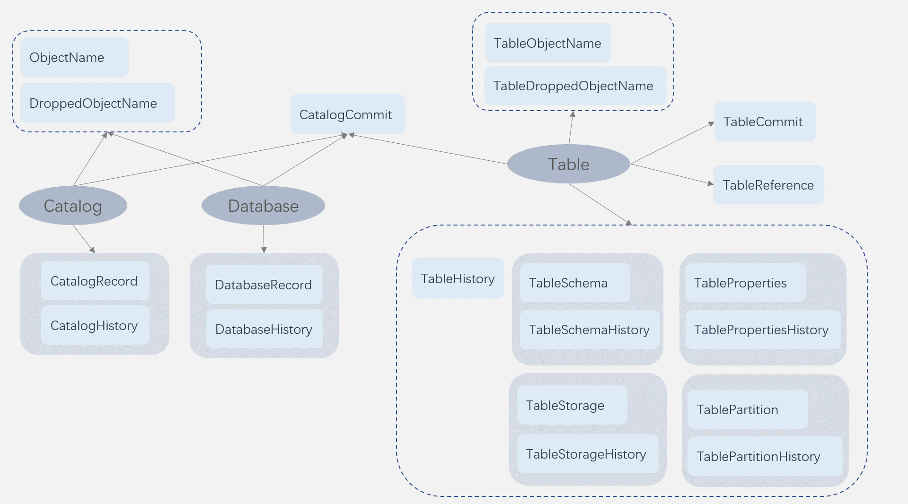

# Catalog server表结构说明

catalog sever采用foundationdb作为数据存储的组件，设计目标是支持catalog内各种数据对象的元数据存储存储，提供多版本的管理能力，提供类似git的分支的管理能力。

元数据表分为2类：1是记录当前的状态元数据表，2是记录历史状态的版本元数据表。

当前状态的元数据表，有2个作用，1是可以快速获取当前的对象的状态，2是可以用作互斥，并发执行的互斥操作，在修改当前表时，都会因为修改了相同记录，产生事务冲突。事务冲突会导致失败的那个事务进行重试，重试会重新申请事务，从而达到互斥的目的。

开发接口上，使用了record layer，record layer是对fdb进行了封装，采用了类似关系型数据库的操作语义，采用proto buf作为记录的格式。

以下介绍的表结构，都是基于proto buf的定义方式进行描述。

## 全局对象表

### object name表

object name 表是记录了当前有效状态的，catalog，database对象的名称到对象id的映射关系（不包含table对象）。

object 表的作用有2个，1是可以检查同名对象，2是可以快速索引对象的id。

| ObjectName                                                   |
| ------------------------------------------------------------ |
| required int32 **type** (primary key, 对象类型是database 或者是catalog对象，类型在ObjectType中详细定义) |
| required string **parent_id** (primary key，当前对象的上一层对象的id) |
| required string **name** (primary key， 当前对象的名称)      |
| required string object_id （当前对象的id）                   |

### dropped object name表

dropped object name 表是记录了当前删除状态的，catalog，database对象（不包含table对象）。

| DroppedObjectName                                            |
| ------------------------------------------------------------ |
| required int32 **type** (primary key, 对象类型是database 或者是catalog对象，类型在ObjectType中详细定义) |
| required string **parent_id** (primary key，当前对象的上一层对象的id) |
| required string **name** (primary key， 当前对象的名称)      |
| required string **object_id** （primary key，当前对象的id，删除状态的对象可能会有同名，这里需要把对象id也作为primary key） |
| required int64 dropped_time                                  |

### table object name表

table object name 表是记录了当前有效状态的，table 对象的名称到对象id的映射。

| TableObjectName                               |
| --------------------------------------------- |
| required string **catalog_id** (primary key)  |
| required string **database_id** (primary key) |
| required string **name** (primary key)        |
| required string object_id                     |

### dropped table object name表

dropped table object name 表是记录了当前删除状态的，table对象。

| DroppedTableObjectName                                       |
| ------------------------------------------------------------ |
| required string **catalog_id**  (primary key)                |
| required string **database_id** (primary key)                |
| required string **name** (primary key)                       |
| required string **object_id** (primary key)                  |
| required int64 create_time                                   |
| required int64 dropped_time                                  |
| required ObjectDropType drop_type (table 支持purge删除数据，这个是用于区分是purge删除，或者是标记删除) |

## catalog对象

### catalog record表

catalog record是当前状态表，记录了当前有效的catalog信息

| CatalogRecord                                                |
| ------------------------------------------------------------ |
| required  string **project_id**  （primary key）             |
| required string **catalog_id**  （primary key）              |
| required string name  （catalog的名称）                      |
| required  string create_time                                 |
| map<string, string> properties  （catalog的属性信息）        |
| optional ObjectType parent_type  （分支特性使用，可以表示数据分支，或者是share对象分支[^2]） |
| optional string ***parent_project_id*** [^1]（secondary index 分支特性使用，记录父分支project id） |
| optional string ***parent_id***  [^1]（secondary index 分支特性使用，表示父分支的catalog id） |
| optional bytes parent_version  （分支特性使用，表示父分支的版本） |
| optional string user_id                                      |

[^1]: parent_project_id 和 parent_id 构成了2级索引，用于索引catalog有哪些子分支
[^2]: 分支是catalog的数据对象管理的基础特性，利用分支特性可以包装出其他的特性，例如，share，share可以看作一种特殊的分支，这个分支上不能修改父分支的数据对象，只能查询父分支的数据对象，并且引用的父分支的版本总是最新版本，可以看到父分支数据对象的最新变化。

### catalog history表

catalog history表是历史状态表，记录了catalog属性修改的历史记录，例如catalog改名，会增加一条catalog history表的记录。

| CatalogHistory                                            |
| --------------------------------------------------------- |
| required string **event_id**[^3] （primary key）          |
| required string ***project_id*** [^4]（secondary index）  |
| required string ***catalog_id***[^ 4]（secondary index）  |
| required string name                                      |
| map<string, string> properties                            |
| optional bool dropped                                     |
| optional bytes version [^5]（读取这个记录时填充版本信息） |
| optional ObjectType parent_type                           |
| optional string parent_id                                 |
| optional bytes parent_version                             |

[^3]: 历史表利用了fdb的特性，在每条记录上都自动会插入事务的版本信息，但是由于网络异常等其他原因，事务的提交状态在client端看来是未知的，也就是事务可能已经提交成功，但是由于网络超时，返回失败了。对于这种异常，只能采取重试的方法。重试需要准确的判断出来，之前的事务是否已经提交成功，这就要求历史表记录的primary key必须是幂等的，也就是重复插入时可以判断出来key是否相同。所以我们采用了uuid作为primary key。这样再发生提交状态未知的异常时，可以通过重试判断对应的历史记录是否插入。
[^4]: project_id，catalog_id 会被设置为带历史版本的2级索引，这种2级索引会自动的插入版本信息，业务流程主要利用2级索引检索catalog的修改的历史信息。
[^5]: 历史表的版本信息是fdb自动插入的，record layer封装了fdb的操作，自动扩展了key里面的version字段，插入记录时业务流程无需感知。读取时需要获取到记录的版本信息，回填到version字段，让业务流程获取到版本信息。

### catalog commit表

catalog commit表用于记录，catalog内所有对象的事务提交信息，数据和元数据的修改都会产生一次事务。例如，table创建，table改名，db创建，table数据写入等操作，都会产生一条catalog commit表的记录。

| CatalogCommit                                                |
| ------------------------------------------------------------ |
| required string **event_id**[^ 3]  (primary key）            |
| required string ***project_id***  (secondary index)          |
| required string ***catalog_id*** (secondary index)           |
| required int64 commit_time                                   |
| required string operation (描述了这次事务的操作内容，在OperationType定义了操作的类型) |
| required string detail                                       |
| optional bytes version [^5]                                  |

## database对象

### database record表

database record是当前状态表，记录了当前有效的database信息。

| DatabaseRecord                                  |
| ----------------------------------------------- |
| required string **project_id**  (primary key）  |
| required string **catalog_id**  (primary key）  |
| required string **database_id**  (primary key） |
| required string catalog_name                    |
| required string name  （database 名称）         |
| map<string, string> properties                  |
| required string location                        |
| optional string create_time                     |
| optional string description                     |
| optional string user_id                         |

### database history表

databse history表是历史状态表，记录了database属性修改的历史记录，例如database改名，会增加一条databse history表的记录。

| DatabaseHistory                                         |
| ------------------------------------------------------- |
| required string **event_id**[^3] (primary key)          |
| required string ***catalog_id***[^4] (secondary index)  |
| required string ***database_id***[^4] (secondary index) |
| required string name                                    |
| required string create_time                             |
| optional bytes version[^5]                              |
| map<string, string> properties                          |
| required string location  (database内数据的存储位置)    |
| required string description                             |
| required string user_id                                 |

## table对象

table对象是具体的数据记录的载体，是操作最为频繁的对象之一。fdb是kv型的数据库，kv是单次数据操作的最小粒度，为了减少业务流程，元数据操作的写放大和读放大。table对象的元数据表，根据类型拆分为多个表。每个表独立表征一个属性，这样在修改时，可以做到最小粒度的读写放大。

table对象，按照属性，划分为TableReference，TableSchema，TablePartition，TableProperties，TableStorage。每个表又分别对应一张记录历史状态的历史状态表，TableHistory，TableSchemaHistory，TablePartitionHistory，TablePropertiesHistory，TableStorageHistory。以及记录table内包含数据和元数据，所有事务提交状态的TableCommit表。

### table reference表

table reference表记录了table的数据和元数据的当前状态，由于table的元数据和数据索引的量都比较大，reference表只是记录了数据和元数据的修改时间作为当前状态，具体的元数据和数据索引的内容都可以利用version信息在table对应的历史状态表中进行检索，即查询距离当前version最近的一个历史记录，就是最新的数据状态。reference表的最大作用是互斥，也就是对于数据索引的记录要求串行执行，我们当前的数据索引，每个记录都是表征了完整的数据快照信息，所以必须包含前一次的提交记录。

| TableReference                                |
| --------------------------------------------- |
| required string **catalog_id** (primary key)  |
| required string **database_id** (primary key) |
| required string **table_id** (primary key)    |
| required string name                          |
| optional string latest_meta                   |
| optional string latest_data                   |

### table schema表

table schema表记录了table的schema信息，也就是列的描述信息。列的详细定义在Column的proto文件中定义。

| TableSchema                                   |
| --------------------------------------------- |
| required string **catalog_id** (primary key)  |
| required string **database_id** (primary key) |
| required string **table_id** (primary key)    |
| repeated Column column （列的详细信息）       |

### table storage表

table storage表记录了table的存储位置，文件格式等信息。

| TableStorage                                               |
| ---------------------------------------------------------- |
| required string **catalog_id**  (primary key)              |
| required string **database_id** (primary key)              |
| required string **table_id**  (primary key)                |
| required string location  （数据存储的位置信息）           |
| required string source_short_name (默认值是 carbon)        |
| optional string file_format （文件格式， 默认值是 carbon） |
| optional string input_format                               |
| optional string output_format                              |
| optional string serde                                      |
| optional string user_id                                    |

### table properties表

table properties记录了table的一些属性信息。属性通过map表记录，可以灵活的定义属性的名称和属性值。

| TableProperties                                 |
| ----------------------------------------------- |
| required string **catalog_id**    (primary key) |
| required string **database_id**  (primary key)  |
| required string **table_id**  (primary key)     |
| map<string, string> properties                  |

### table partition表

table partition表记录了table的分区信息。

| TablePartition                                |
| --------------------------------------------- |
| required string **catalog_id** (primary key)  |
| required string **database_id** (primary key) |
| required string **table_id** (primary key)    |
| required string name                          |
| required string partition_id                  |
| optional string location                      |
| optional string file_format                   |
| optional string input_format                  |
| optional string output_format                 |
| optional string serde                         |
| map<string, string> properties                |

### table history表

table history表是table数据的历史信息记录。每一条历史记录都是写入时刻，table完整数据的快照记录。

| TableHistory                                             |
| :------------------------------------------------------- |
| required string **event_id**[^3] (primary key)           |
| required string ***catalog_id*** [^4] (secondary index)  |
| required string ***database_id***[^4]  (secondary index) |
| required string ***table_id*** (secondary index)         |
| optional SegmentSetType segmentType （segment索引类型）  |
| optional string cur_set_id （当前segment记录索引的位置） |
| repeated string set_ids （segment记录的索引）            |
| optional string table_index_url                          |
| optional bytes version[^5]                               |

### table schema history表

table schema history表是table schema修改的历史信息记录。每一条历史记录都是修改时刻，完整的schema记录。

| TableSchemaHistory                                      |
| ------------------------------------------------------- |
| required string **event_id**[^3] (primary key)          |
| required string ***catalog_id***[^4] (secondary index)  |
| required string ***database_id***[^4] (secondary index) |
| required string ***table_id***[^4] (secondary index)    |
| optional bytes version[^5]                              |
| repeated Column column （列的详细信息）                 |

### table storage history表

table storage history表是table storage修改的历史信息记录。

| TableStorageHistory                                      |
| -------------------------------------------------------- |
| required string **event_id**[^3] (primary key)           |
| required string ***catalog_id***[^4]  (secondary index)  |
| required string ***database_id***[^4]  (secondary index) |
| required string ***table_id***[^4] (secondary index)     |
| required string location （数据存储的位置信息）          |
| required string source_short_name （默认值是 carbon）    |
| optional string file_format （默认值是 carbon）          |
| optional string input_format                             |
| optional string output_format                            |
| optional string serde                                    |
| optional string user_id                                  |
| optional  bytes version [^5]                             |
| map<string, string> properties                           |

### table properties history表

table properties history表是table properties 修改的历史信息记录。每一条历史记录都是修改时刻，完整的properties记录。

| TablePropertiesHistory                                   |
| -------------------------------------------------------- |
| required string **event_id**[^3]  (primary key)          |
| required string ***catalog_id***[^4]  (secondary index)  |
| required string ***database_id***[^4]  (secondary index) |
| required string ***table_id***[^4] (secondary index)     |
| map<string, string> properties                           |
| optional bytes version[^5]                               |

### table partition history表

table partition history表是table partition修改的历史信息记录。每一条历史记录都是修改时刻，完整的partition记录。

| TablePartitionHistory                                   |
| ------------------------------------------------------- |
| required string **event_id**[^3] (primary key)          |
| required string ***catalog_id***[^4] (secondary index)  |
| required string ***database_id***[^4] (secondary index) |
| required string ***table_id***[^4] (secondary index)    |
| required bytes version[^5]                              |
| required string name                                    |
| required string partition_id                            |
| optional string location                                |
| optional string file_format                             |
| optional string input_format                            |
| optional string output_format                           |
| optional string serde                                   |
| map<string, string> properties                          |

### table commit 表

table commit表用于记录，table内所有数据和元数据变化事务的提交信息，数据和元数据的修改都会产生一次事务。例如，table创建，table改名，table数据写入等操作，都会产生一条table commit表的记录。table commit的信息在catalog commit中都有包含，单独记录一份table commit信息是为了快速检索table相关的修改记录。

| TableCommit                                                  |
| ------------------------------------------------------------ |
| required string **event_id**[^3]  (primary key)              |
| required string ***catalog_id***[^4] (secondary index)       |
| required string ***database_id***[^4] (secondary index)      |
| required string ***table_id***[^4] (secondary index)         |
| required string table_name                                   |
| required int64 create_time                                   |
| required int64 commit_time                                   |
| repeated Operation operation （事务的操作描述）              |
| optional int64 dropped_time （如果是删除操作需要单独记录删除的时间） |
| optional bytes version [^5]                                  |

## 元数据表关系汇总

1. 虚线框表示可选其中的一种或者几种属性进行更新，例如table元数据更新时，可以更新 schema或者properties。
2. 深色框表示属性必须同时更新，例如更新schema，需要同时更新TableSchema和TableSchemaHistory。

