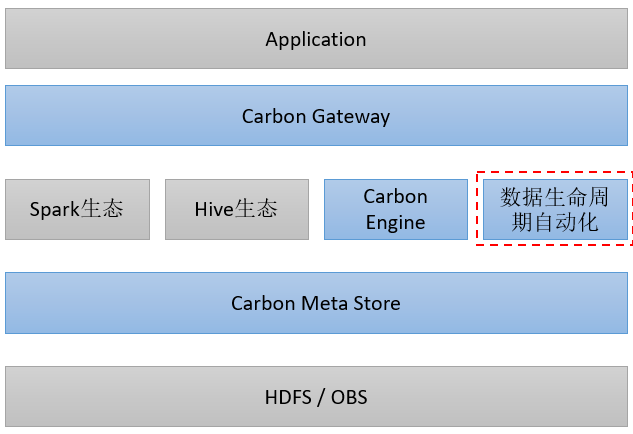
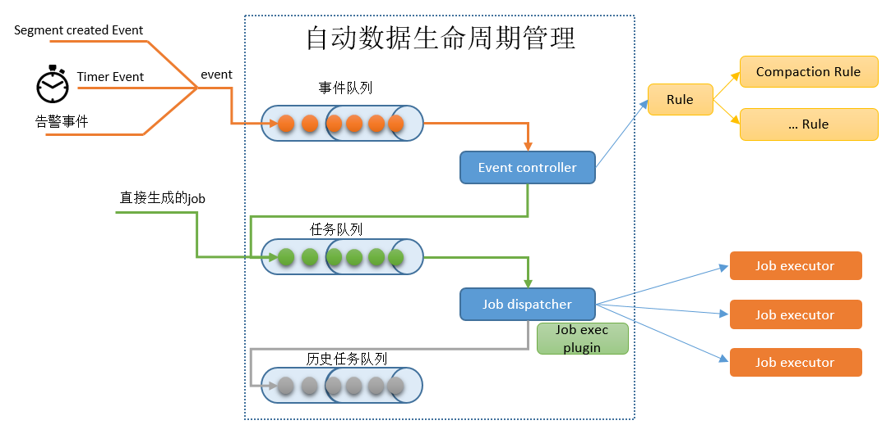
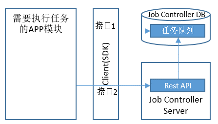
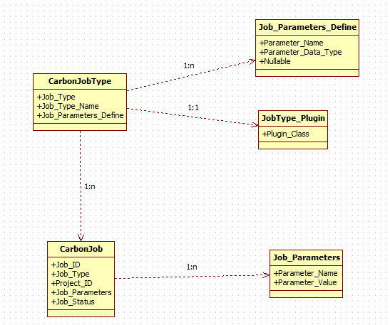
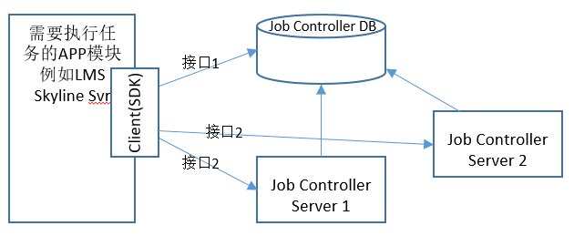
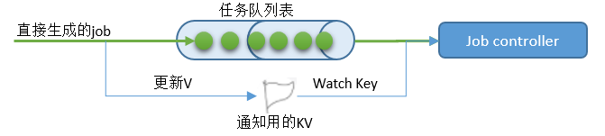
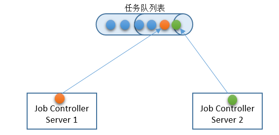

# Auto Lake using asynchronous job controller

## 需求背景

为了提升数据湖的易用性，实现数据湖的自动生命周期管理、自动优化等任务，需实现Job Controller



其中Job控制器用于管理数据生命周期 自动化中的所有任务，根据任务规则去生成相应的任务，以及按照时效性及时的运行数据生命周期自动化的任务，从而对数据进行优化整理，保障查询的效率以及存储的高效。

## 如何实现

TODO


## 设计和实现

### 1.1.1 端到端业务过程

自动运行的任务的来源分为两类：

1. 系统中已经确定的Job，例如：Purge Table产生的Job，该类型的Job就是去清理文件和Table Metadata。
2. 系统发生的事件，这些事件会触发生成一系列的自动化任务，例如：
   - 时钟事件，会生成一些周期性的维护任务
   - Table Partition变更事件，可能会导致系统做Compaction
   - 系统采集的一些统计数据到来，可能会运行自动优化的一些任务

上面说的可能都是需要一系列判断规则的，这些规则满足了就会生成具体的Job并执行。本文档描述Job控制器的内容，Event控制器的内容不在本文档描述。




## 1.2 Job controller对外提供的接口


需要执行后台异步任务的模块，可以使用任务的Client SDK来生成，任务生成接口分为两种：

1. 是和客户端处于同一个事务，直接写入到任务队列表中。
2. 消息接口的方式调用Job Controller的接口，写入到任务队列中。





### 1.2.1 客户端事务中直接写任务接口：

```bash
BackgroundJobDbPlugin clientSDK = JobControllerPluginFactory.getBackgroundJobDbPlugin();

BackgroundJobRecord jobResult = clientSDK.createBackgroundJob(FDBRecordContext context, BackgroundJobRecord job);

其中：FDBRecordContext context为FDB的数据库连接信息，客户端业务也是这个连接，共事务。

message BackgroundJobRecord {
  required string job_id = 1;			// 返回的任务ID
  required int32 job_type = 2;
  required string catalog_id = 3;
  map<string, string> job_params = 4;
  required JobStatus job_status = 5;
}
```

该接口的特点：

1. 和客户端的业务同一个FDB连接，事务一致性高，确保事务成功才会发布任务，事务失败不会多发任务Job。


该接口的限制：

1. 由于利用数据库保持事务一致性，所以客户端也需要使用FDB。


### 1.2.2 消息创建事务性接口：

为了确保一致性，消息类创建任务事务性接口分为两个一组：

1. 第一个是预提交Job
2. 第二个是确认提交Job

预提交Job的时候，需要提供一个事务成功与否确认回调URL，当第二个确认提交Job没收到时候，Job控制器会过段时间回调，判断发送方是否确实事务完成了。如果完成了才会执行Job，未完成或者访问识别，只会记录错误告警。


```bash
REST接口
/v1/{project_id}/pre_create_job
/v1/{project_id}/end_create_job

SDK实现：
Job_ID preCreateJob(PolyCatJob job, External_ID, Callback_URL|Verify_Function);
Result endCreateJob(Job_ID);
```


注：**当前迭代暂时不提供该类接口**。


### 1.2.3 普通消息创建接口

针对客户端无事务需求的场景，提供一次性创建任务的接口：


```bash
BackgroundJobDbPlugin clientSDK = JobControllerPluginFactory.getBackgroundJobRemotePlugin();

BackgroundJob clientSDK.createBackgroundJob(CreateBackgroundJobRequest request);

```


# 2. Job相关数据结构

逻辑概念如下图，字段名是示例：




## 2.1 Job类型

Job类型是可添加注册的，所以不采用enum的方式预先指定。Job类型为一个字符串（例如“Drop_Table_Purge_Job”），全局唯一。

当前版本需要做的有两个：

```bash
	"Drop_Table_Purge_Job";
	"Compact_Table_Job";
```


## 2.2 Job Executor Plugin


每个Job Executor Plugin负责一种Job类型的执行。

```bash
public interface JobExecutorPlugin {
    void execute(BackgroundJob job);
    BackgroundJobType getJobType();
    String getShortName();
}

从该类派生，然后放在ServiceLoader.load(JobExecutorPlugin.class)可加载目录中，既可以添加一个新的Job类型。
```


## 2.3 查询注册的Job类型

```bash
Job控制器提供一个查询加载的Job类型的接口：

List<BackgroundJobType> getAllRegisteredJobType();
```


# 3. 主要一些设计考虑点


## 3.1 如何实时监控任务的生成

实际上的部署形态，Job控制器是单独实例部署的，和Job的客户端解耦，类似下图：




此处在任务生成后，如何被controller快速看到，会影响Job执行的端到端实时性。

可选方案：

1. Client生成任务后，直接通知某个Job Controller。
2. 如果Client是调用Controller的远程Rest接口生成的任务，理论上该Controller会立即知道有任务生成。
3. Job Controller监控（Watch）数据库的实时变化。
4. Job Controller定期轮训数据库的变化。


考虑到运行环境的复杂性，Job Controller随时都有可能重启，以及节点间迁移。所以上述方案1和2都不能保证任务的完整执行，重启后执行中的任务就丢失了，方案中还是需要有3和4进行保底。确保任务不丢。


**具体的Watch方案还需要讨论：** 

由于暂时没找到Record Layer的Watch能力，一个保底的方案如下：



单独建一个特殊的KV，用于通知Job Controller，每次生成任务的时候，需要再Touch一下这个KV来通知。

如果一个Job Controller Watch这个Flag KV是没问题的，多个Job Controller同时Watch一个KV的行为还需要验证。


## 3.2 Job控制器实例数量


### 3.2.1 Job控制器如果启动多个实例：




此时，每个控制器都会去看任务队列中有没有刚创建的Job，如果有，就将其状态修改为运行中，并开始实际执行该Job。任务列表是公共的，所以多个Controller会同时看到这些Ready任务，所以会产生争抢现象。由于FDB事务性的，如果采用update job_status = running where job_status == ready的方式去抢占这个任务的执行权，第二个及以后的Job控制器会修改失败。此时第一个修改成功的控制器会得到该任务。这也可以理解为给这个记录加锁，只有加锁成功的控制器才是该任务的执行者。

还有一个场景需要处理，就是如果某个控制器得到了某几个Job的执行权，而在执行过程中进程崩溃了。这几个Job需要有个机制被别的控制器能拿到继续执行。而此时这几个Job的状态已经是Running中了（也就是被别人加锁了，处于一直running的状态）。需要有个协调机制让长期没有运行完的Job被别的控制器能接管并继续执行。这个协调机制可以是：

1. 由抢占的控制器给任务加最近更新时间（类似心跳），如果死了不更新了，约定一定时间后就可以被再次某个别的控制器抢占。
2. 控制器之间互相监控是否存活，如果不存活则可以抢占该控制器曾经占用的任务（此时需要给任务上标记那个控制器正在抢占并执行）。


### 3.2.2 Job控制器如果同时只有一个实例运行：

此时只有一个控制器进行Ready任务的状态修改和执行，不需要进行协调。


## 3.3 事务性


所有的对LMS操作的命令都由控制器而不是任务执行者进行变更（这在执行者放在外部集群的情况下会法伤），能够保障整体的任务事务一致性。


## 3.4 任务历史

考虑到任务执行的高效，需要对任务进行状态的反复变更操作，所以任务执行完后，需要从当前任务队列中移动到历史任务队列中。

控制器提供历史队列中任务历史的查询。


```bash
List<BackgroundJob> queryHistoryJob(QueryCondition condition);
```

## 如何测试

TODO
