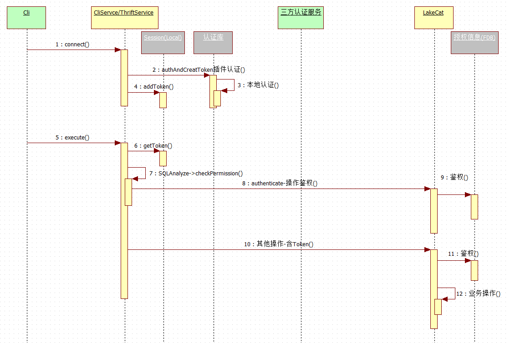
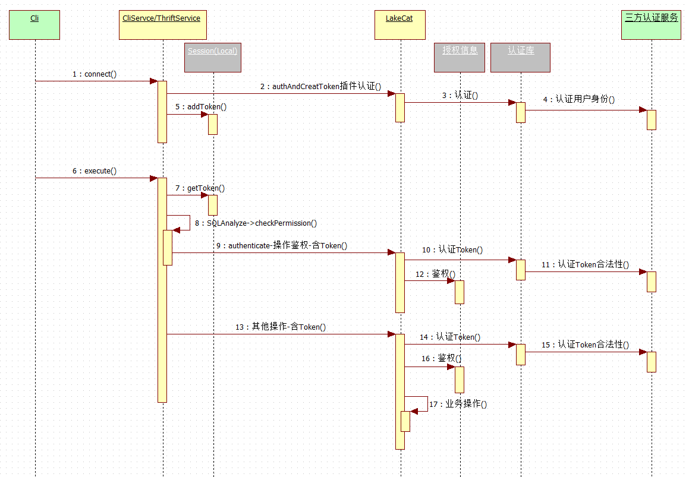
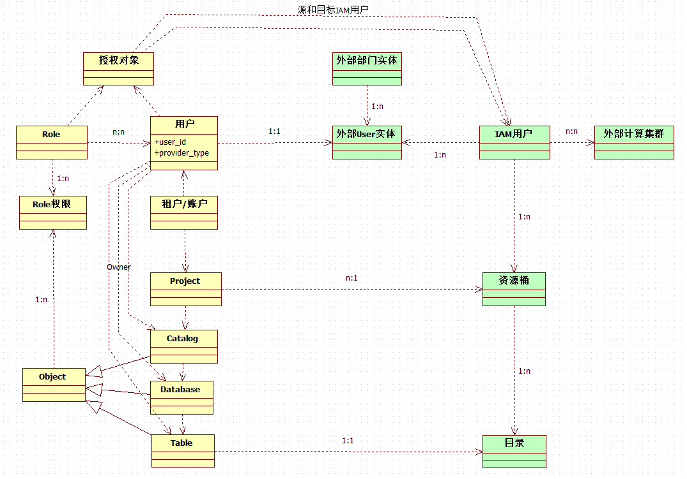
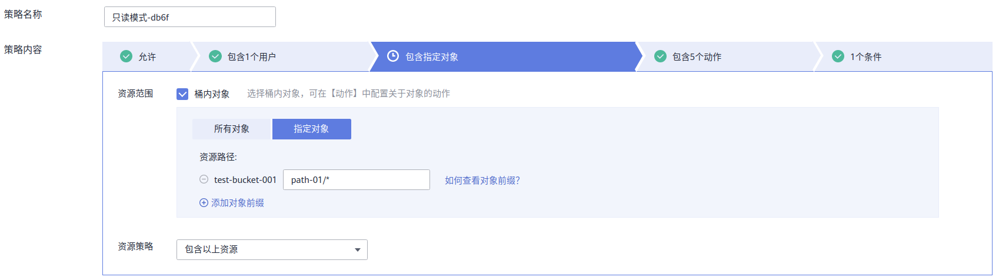
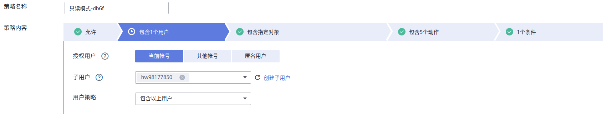
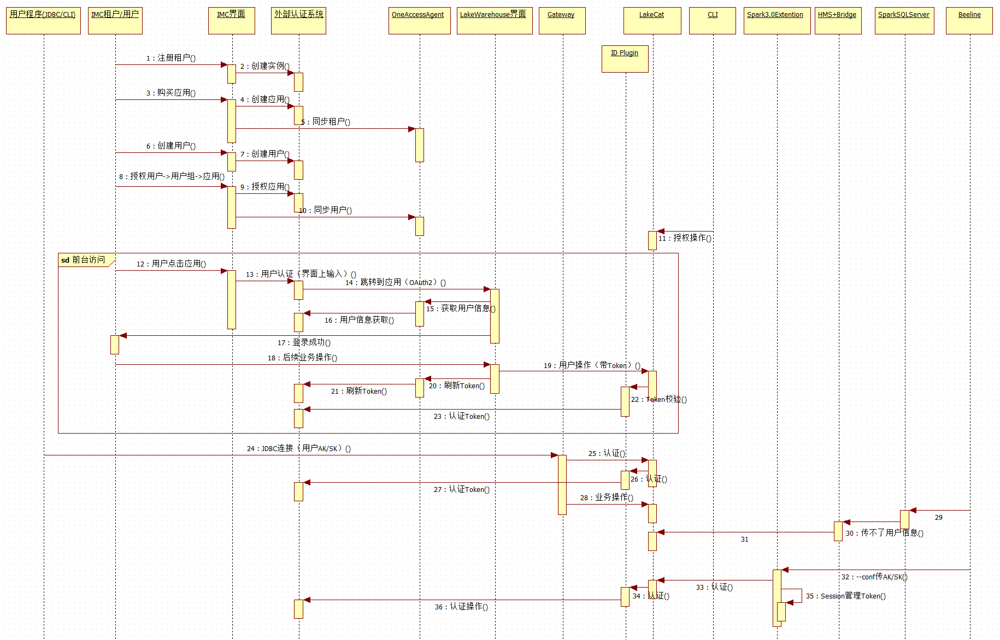

# PolyCat的3A(Account, Authentication, Authorization)设计调整

## 1. 背景

为了支持多种外部客户的认证场景，PolyCat本身的一些认证能力进行一些优化调整


## 2. 如何使用

涉及的是内部接口和代码位置调整，对外的使用接口没变更。


## 3. A3的当前实现




1. 在Gateway上的认证，是由一个本地的组件实现的（catalog.authentication模块），当前是Gateway和PolyCat分别组件引用到本进程内使用。
2. 目前已经抽象出Authenticator接口，进行认证和Token校验工作。
3. 还没有对接第三方外部的认证接口，例如IAM，IMC，LDAP。
4. 目前针对SQL，提供了批量authenticate接口，可以在SQL解析的时候进行一次性权限认证。
5. 目前针对每一次调用，还没有进行调用者身份验证以及二次权限确认。
6. 目前Token的概念是有的，但是没有进行实际的使用。


## 4. 建议改进方案




主要修改如下：

1. 第2步，将本地认证移动到PolyCat的认证，这样未来其他连接PolyCat的客户端也可以使用。
2. 第4步，认证库支持插件机制，实现一个ID Plugin（实现一个Authenticator接口的插件），该Plugin负责到第三方认证服务进行相应的认证。
3. 第5步和第7步，需要将Token记录下来并传递到后继的每一次调用中。建议放在 Session中保存，这样Session终止后，可以让用户重新认证。
4. 第9步和第11步，所有的操作必须带合法的Token，否则访问会失败。这个是为了PolyCat认证它的客户端身份。
5. 第10步和第14步，每次业务操作之前，需要调用ID Plugin进行Token合法性判断（是能避免第三方认证服务的用户已经修改或者删除的场景）。


*说明：*

茄子场景中，SparkCatalog插件的位置和Gateway位置类似，也是使用这两个接口进行相关的认证和鉴权操作。

*如果入口是Gateway，需要考虑直接认证的方案。*

*添加Token刷新的能力，如果记录在认证库中，认证库需要记录Session和Token的关系，以及定时能力*


### 4.1 如何扩展插件

1. 引入Authenticator包的依赖

   ```
       <dependency>
         <groupId>io.polycat</groupId>
         <artifactId>polycat-catalog-authentication</artifactId>
         <version>${project.version}</version>
       </dependency>
   ```

   

2. 从接口派生Authenticator自己的认证能力

   ```
   public interface Authenticator {
       AuthenticationResult authAndCreatToken(Identity identity) throws IOException;
       String getShortName();
       TokenParseResult CheckAndParseToken(String token) throws IOException, ClassNotFoundException;
   }
   ```

   

3. 在class加载文件中添加扩展类名

   ```
   └── resources
       └── META-INF
           └── services
               └── io.polycat.catalog.authentication.api.Authenticator
   
   $ cat io.polycat.catalog.authentication.api.Authenticator 
   io.polycat.catalog.authentication.impl.LocalAuthenticator
   io.polycat.catalog.authentication.impl.IMCAuthenticator
   ```

   

4. 打包放入PolyCat安装目录lib目录下（Authentication模块的jar包会打在同一个目录下），如果有配置文件，放在conf目录下（*需要验证下*）。


### 4.2 一些设计问题考虑

#### 4.2.1 认证能对什么进行进行验证

由于不同的三方认证系统能提供的认证能力不同，建议步骤2和步骤3的身份认证信息可以支持多种方式，例如：用户名/密码，AK/SK等。


#### 4.2.2 Gateway（SparkCatalog扩展）和PolyCat之间的信道安全

PolyCat提供HTTS证书的方式提供安全通道服务。


#### 4.2.3 每次访问都对Token进行二次合法性判断，且调用三方认证服务，性能是否能满足需求

二次合法性判断从业务上是需要的，性能问题可以根据实际测试结果进行优化，可选的优化可以考虑：本地内存缓存以及变更订阅等能力。


## 5. 鉴权和身份映射，以及外部资源隔离



当调用授权的时候：

1. GRANT ROLE role1 TO USER user1@xxxxxxxx的时候，需要到外部身份提供者验证user1是否有效。
2. GRANT ROLE role1 TO USER user1@xxxxxxxx的时候，需要查看Role有权限的Table的桶，以及它Owner的IAM用户。同时查看被授权用户的映射IAM用户。如果这两个用户不一样，除了做内部对象的授权记录，还需要做外部IAM对象的授权记录。
3. 做外部对象的授权记录的时候，需要调用IAM的接口进行IAM中（租户A-桶-目录）->（租户B->用户）的权限新增。
4. REVOKE权限的时候，需要调用IAM的接口进行IAM权限收回（有引用计数，少于1才真正删除）


*一致性问题*

* 如果内部授权完毕，结果外部资源授权失败，这种情况如何处理？(可以考虑后台任务不断尝试)


### 5.1 权限授予(huawei-cloud)

*选择对象*

1）权限可以控制选择某个桶下的某个目录



2）可访问的用户可以是本租户的某个用户，或者是别的租户的某个用户。



3）可以控制读取/读写/只能列目录等具体操作

4）可以附加其他条件，例如一段时间等


## 6. IMC场景




IMC场景中，如果将Lakewarehouse看成一个整体服务，则需要提供给IMC的OneAccess几类接口：

1. 租户开户接口（以及维护接口）
2. 用户开户接口（以及维护接口）
3. 界面的OAuth2对接能力（如果提供界面的应用才需要）

需要外部IMC/OneAccess提供的接口：

1. 根据用户名/密码或者AK/SK的认证接口

