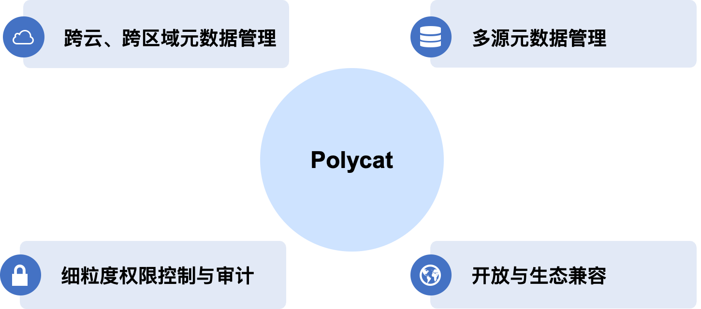
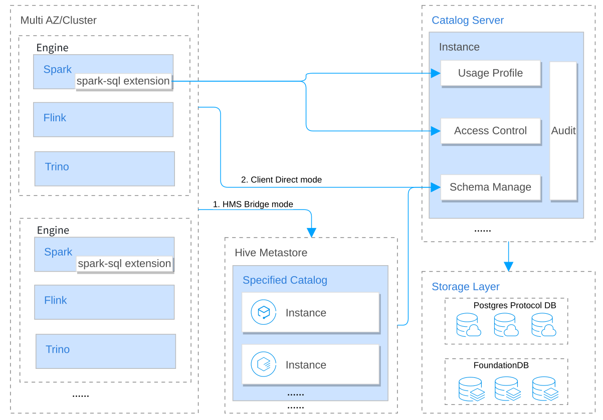

# Polycat：面向云原生湖仓的统一元数据管理系统

## 简介
Polycat是一款云原生的元数据管理系统，帮助使用者高效地管理来自不同云、不同区域的多个数据源。Polycat具有强大的功能，包括多租户、多级元数据管理等，同时还提供了细粒度的访问控制和全面的审计跟踪功能，确保数据的安全性和合规性。Polycat可以帮助使用者实现数据的一体化管理和治理，提高数据资产的价值和利用率。
 

    
   </a>

## 功能特性
 

    
   </a>

### 统一的元数据管理
Polycat提供了一个统一的元数据管理系统，支持来自多个云的不同数据源。这意味着您可以轻松地在单个位置管理来自不同类型的数据源（如Hive、Iceberg、Hudi等）在不同云（如AWS、Google Cloud、Azure等）的元数据。通过这种方式，Polycat使得跨数据孤岛搜索和管理数据资产变得容易。

### 增强的元数据管理
Polycat旨在支持多个租户，具有管理元数据的能力，包括目录、数据库、表和分区信息。此外，该系统还包括支持详细的元数据统计信息。

### 统一的数据授权
细粒度的访问控制对于确保数据资产的安全和隐私至关重要。Polycat包括数据授权功能，允许您控制谁可以访问特定的数据资产以及他们可以在这些资产上执行的操作。您可以使用基于角色的访问控制（RBAC）来定义符合组织需求的访问策略。

### 详细的历史回溯
元数据存储跟踪元数据随时间的变化，使您可以查看数据资产随时间的演变情况。此功能特别适用于审计或分析数据景观中的变化。您可以查看数据资产的完整历史记录，包括其模式、所有权和其他元数据属性的更改。

### 与现有工具的无缝集成
Polycat通过HMS桥支持HMS协议，使现有的计算引擎如Apache Spark、Apache Flink、Trino等可以无缝地与Polycat交互，无需进行任何更改。

### 高度可扩展
Polycat旨在具有高度可扩展性，适用于大规模数据湖部署。随着元数据查询的增长，它可以轻松地进行水平扩展。此外，元数据存储还设计支持不同类型的数据存储，如关系型数据库和分布式数据库。根据估计的数据量，您可以选择适当的存储方式。
